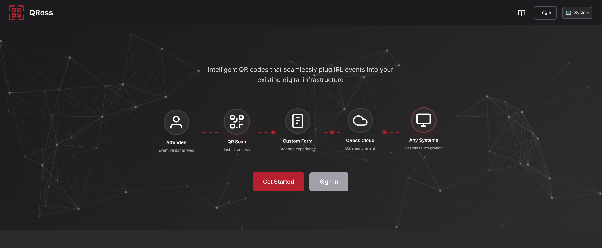

# QRoss Support

### WELCOME!

Welcome to QRoss Support! This is where you can ask questions, report bugs, or provide feedback about our app.

### WHAT IS QRoss?

QRoss is a web platform that allows users to create branded intelligent QR codes to engage their target audiences at IRL events. It can also be used as an analytics enabled URL shortener. For more information, checkout https://qross.xyz.

### HOW DO I USE THIS?

You can go to our [Issue Tracker](https://github.com/QRossXYZ/Support/issues) and submit a new issue there. Make sure you also label your issue with one of the following labels:

- question : A question about a specific feature, use case, or the platform in general
- feedback : Sharing your feedback on using the platform
- feature  : Submitting a feature request
- bug      : Reporting something that's broken
